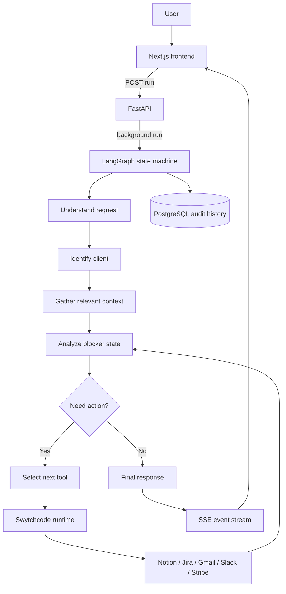

# ClientPilot Architecture

ClientPilot is an agentic operations loop, not a dashboard that calls every API in a fixed order. LangGraph owns conditional decisions, while Swytchcode is the only external integration execution boundary.

## Safety boundaries

- Provider HTTP requests are never constructed in ClientPilot.
- Only canonical tools enabled in Swytchcode `tooling.json` can execute in live mode.
- Demo mode uses the same executor interface with deterministic Acme Corp data.
- User-facing events contain workflow status only; hidden chain-of-thought is never streamed.
- Mutating actions are recorded with completed or failed status.
