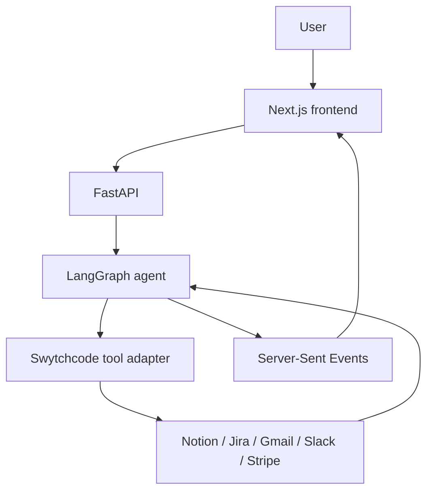

# ClientPilot Architecture

Architecture documentation will be expanded after the backend graph and event contract are implemented.

```mermaid
flowchart TD
    User --> Next[Next.js frontend]
    Next --> API[FastAPI]
    API --> Graph[LangGraph agent]
    Graph --> Tools[Swytchcode tool adapter]
    Tools --> Providers[Notion / Jira / Gmail / Slack / Stripe]
    Providers --> Graph
    Graph --> SSE[Server-Sent Events]
    SSE --> Next
```
